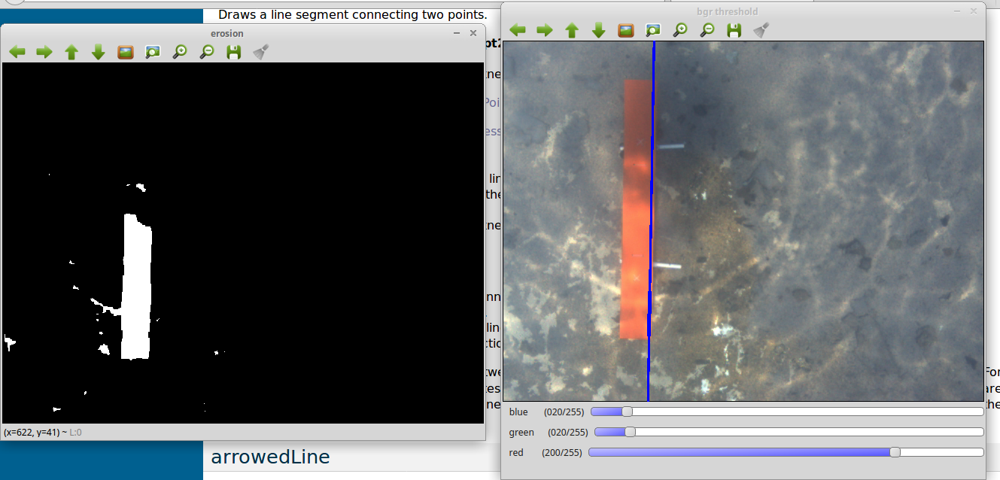
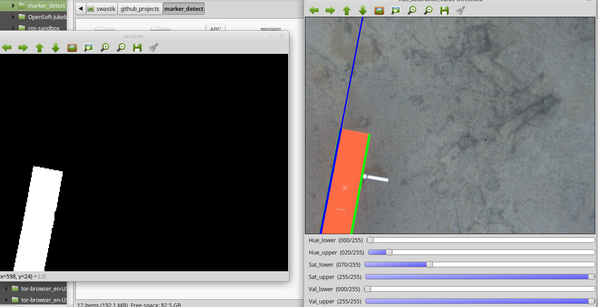

#Marker detection

###Previously
The code was originally using BGR value thresholding to detect the red marker, but since rgb colour values are pretty volatile with respect to lighting conditions, I had to use HSV value thresholding.
####RGB thresholding result

###Working of present code
The program now uses HSV value thresholding to detect the rectangular marker, then it erodes the picture twice to get rid of the noisy blobs, it then does a canny edge detection and uses probabilistic Hough line transform to detect the line segments . Finally the line with the maximum length is found and that line is extended to completely to give the sense of orientation  of the rectangular marker.

###Instructions
To run the program, the test video must be copied into the repo folder. The CMakeLists.txt is configured to create an executable named "i.out" , the path to the video must be specified while running i.out.